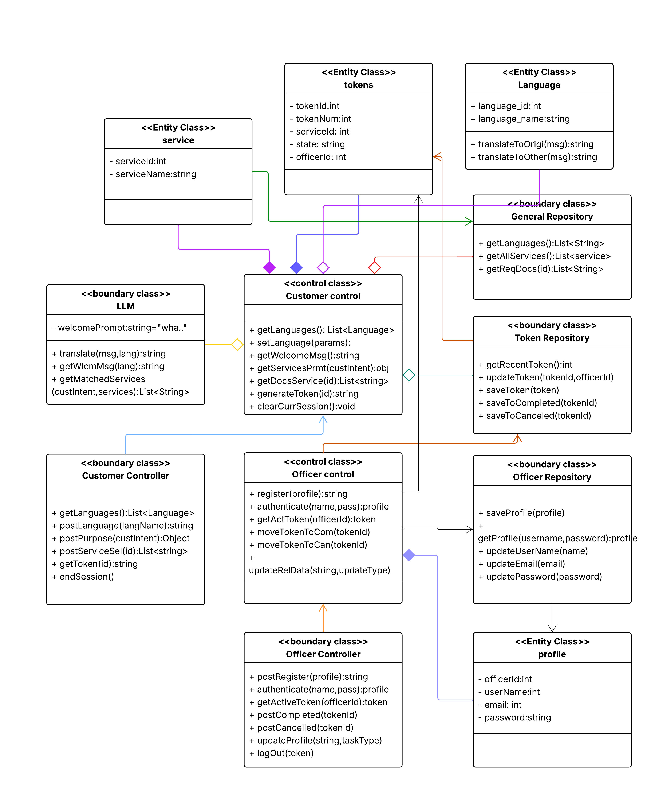

# csms
A customer scheduling management designed to help the customers to schedule them with a token and avoid long queue's in banks to know the services and required documents with querying in multiple languages.

## UML DIAGRAM

  

